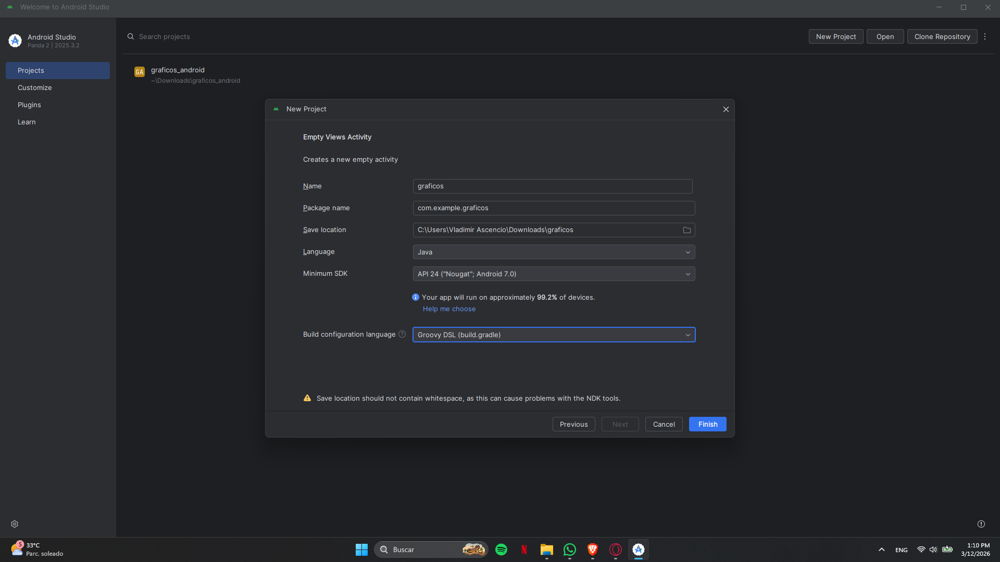
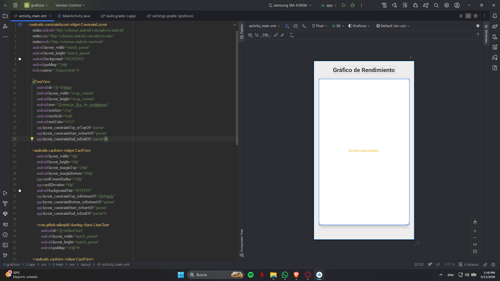
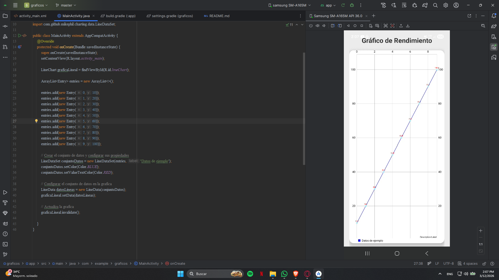
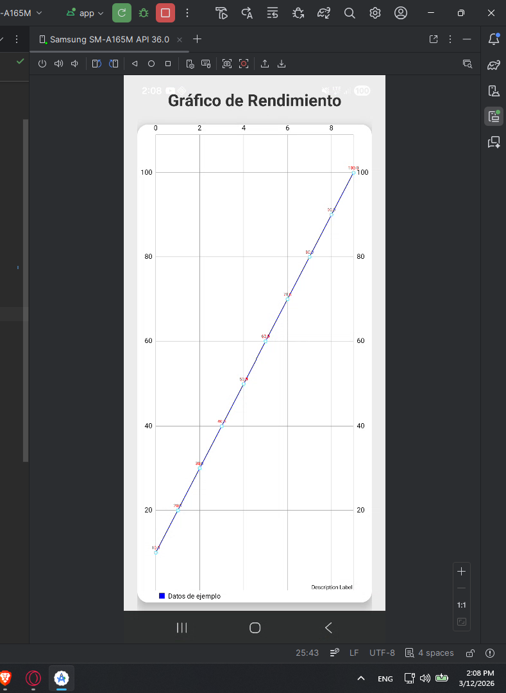

<div align="left">🔴🟡🟢</div>

<br>

## 👤​​ Desarrollo de Aplicaciones Móviles Básicas

**Uso de gráficos en Android Studio y Groovy**

<picture>
  
</picture>


Este repositorio contiene **una app móvil** que facilitan la implementación de gráficos en Android Studio

✅ Java <br>
✅ XML<br>

---

## 🎯 Propósito

Este proyecto está diseñado como práctica de **Desarrollo de Aplicaciones Web Básicas**, enfocado en el uso de gráficos en apps móviles.

---

## Usuario y contraseña

1. build.gradle (debe aparecer plugins, android, entre otros; si está vacío no se debe pegar el link) en dependencies.

```bash
implementation 'com.github.PhilJay:MPAndroidChart:v3.1.0'

```
2. settings.gradle (debe aparecer pluginManagement, pluggins, entre otros; si está vacío no se debe pegar el link) en dependencyResolutionManagement, debajo de maven.
   
```bash
maven { url 'https://jitpack.io' }

```
---

## Crear el proyecto con Groovy.

<figure>
  
</figure>

## Editar el archivo activty_main.xml al gusto para mostrar la gráfica.
<figure>
  
</figure>

## Editar el archivo MainActivity.java para crear la lógica de la gráfica.
<figure>
  
</figure>

## App corriendo correctamente.
<figure>
  
</figure>

<br>

---
## ✨ Autor

Vladimir Ascencio – Desarrollador en aprendizaje continuo 🚀

¡Gracias por visitar este proyecto! 🧑‍💻


---

<h3 align="left">🔎 Contactos</h3>
<table align="center">
  <tr>
    <td align="center">
      <a href="mailto:ascencio3.1417@gmail.com" target="_blank" rel="noopener noreferrer">
        
      </a>
    </td>
    <td align="center">
      <a href="https://www.instagram.com/vl_ascencio" target="_blank" rel="noopener noreferrer">
        
      </a>
    </td>
    <td align="center">
      <a href="https://discord.com/users/vl_ascencio" target="_blank" rel="noopener noreferrer">
        
      </a>
    </td>
    <td align="center">
      <a href="https://github.com/Ascencio7" target="_blank" rel="noopener noreferrer">
        
      </a>
    </td>
  </tr>
</table>

<br><br>

  ---

<!-- Footer -->
<div align="center">
  
</div>
